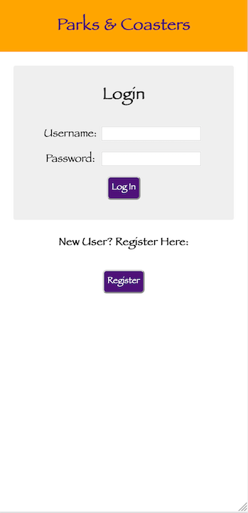
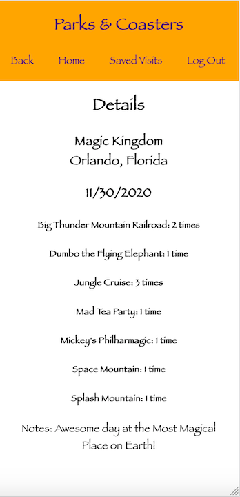

# Parks & Coasters

## Description

Duration: 2 weeks 11/16/2020 - 12/1/2020

I am a big fan of amusement parks and theme parks, as a former ride operator at Valleyfair! and cast member at the Walt Disney World Resort.  I had a season pass to Valleyfair multiple summers when I was a teenager, and had an annual pass for Universal Orlando for many years when I lived in Florida.  I have also had multiple visits the last few years to parks in places like Southern California, the Orlando area, and a road trip through Wisconsin, Illinois, Indiana, and Ohio last summer.  Unfortunately, I do not remember exactly what I did on many of my visits to these places.

This app is an easy way to record specifically what is done during a day at a theme park, by selecting a park for a certain day and incrementing the number of times an attraction has been experienced as the user goes about their day.  Additional notes about the day may also be added.  It then saves a list of prior trips and is a great way to revisit what was done previously to bring back memories, as well as shape future trips to that location.

There were a fair number of challenges to get the app completed.  One of the biggest that I overcame was the functionality to save the notes in the text box.  I made a typo that took about 36 hours to find.  I thought I had fixed it and found another issue five days later.  Now it works great.  Also, it became difficult to keep track of all of the reducers and server routes.  The planning was sufficient for wireframes and database tables, but in the future, I will need to include more planning for sagas and reducers, and server routes.

## Screen Shots

Log In Page

Registration Page

Parks Page

Attractions Page

Date Selection Page

Daily Log Page

Saved Visits Page

Previous Visit Detail Page

### Prerequisites

- The project requires Node.  It may be downloaded here: https://nodejs.org/en/

- The project requires the creation of a database.  Postgresql was used for this project.  Postgresql may be found here: https://www.postgresql.org/  Postico also may be used to visually see the database.  It is found here: https://eggerapps.at/postico/.  The database is titled 'prime_app'.  The entire database.sql file may be copied into Postice and executed to create the six tables and put parks and attractions data into those two table

- The project requires an understanding of HTML, SCSS, JavaScript, React with Redux and sagas, http requests to a server, queries to a database, and an understanding of pool.

## Installation

This project can be forked and cloned from the Github repository.  It has many dependencies that can be installed using the command 'npm install'.  

A Postgresql database is required.  It needs to be called 'prime_app', and the tables can be created by copying the contents of the database.sql file into Postico and executing.

In the terminal, enter the command 'npm run server'.  Open a new terminal window, and enter the command 'npm run client'.  This should open the browser at the Log In page, which can be switched to the registration page to allow a new user to register.

## Usage 

1.  When the application is opened, the user will start at the Landing Page, allowing them to log in, or if a new user, go to the registration page and create a new account.  

2.  Once inside the app, the user will be brought to the home page, which is also the parks page.  A list of all theme parks included in the database is displayed here.  Any park may be clicked on to go to the Attractions page for that park.  

3.  Once the user is on the Attractions Page, a list of all attractions at that park will be displayed.  Each attraction has a heart next to it, which may be clicked on to indicate the attraction as a favorite for that user.  At the top of this page, there is a button to make a new entry for this park.  This will direct the user to the Date Selection Page.  

4.  On the Date Selection Page, the user is prompted to select a date for the visit to the park that was chosen on the parks page.  Once a date is selected, a box appears to confirm that the correct park and date were selected, and then the Daily Log Page appears.  

5.  On the Daily Log Page, a list of all available attractions will be displayed, with the same hearts from the Attractions Page.  There is also a button for 'Experienced Today.'  This allows the user to increment the number of times each attraction has been experienced, to add that to the record for the day.  Additionally, there is a notes box at the bottom of the screen for them to save any text notes desired.  The user may return to this page throughout the day and update the amount of attractions that have been experienced and enter any notes they wish to.  When finished for the day, they may click the Complete Visit button.  This will take them to the Previous Visit Details Page and remove the ability to edit the entry.

6.  When on the Previous Visit Detail Page, they will see only the list of attractions that have been experienced, without the ones they did not do.  The notes entered will also be displayed.  

7.  When the user advances to the Saved Visits Page, which may be done at any point from the navigation bar, they will see all visits that have been previously saved, as well as any that are in progress.  If it is a visit they have marked as complete, they will be able to click the button to be taken to the Previous Visit Details Page to view details.  If it is a visit that is still in progress, they can return to the Daily Log Page by clicking edit.  All visits may be deleted from here.  

## Built With

- Redux-Saga
- React
- SCSS
- Node
- Express
- JavaScript
- HTML
- Postgresql
- Pool
- Axios

## Future Updates

I would like to add the ability for the app to include images, and for the user to be able to upload images.

## Acknowledgements

This could not have been possible without the help and feedback from the rest of the Ukkonen Cohort at Prime Digital Academy, my friend who looked at it and gave feedback, and especially Casie and Kris, our instructors.  Thank you to all.

